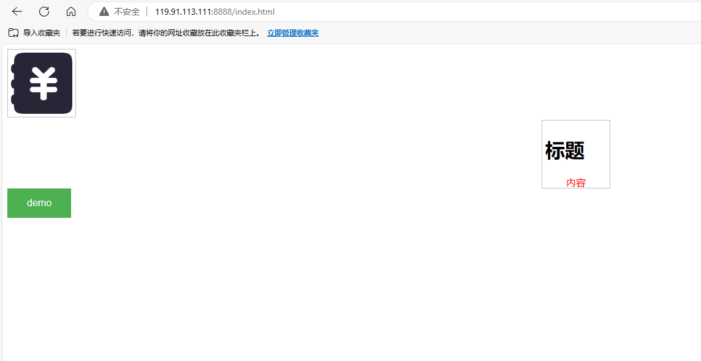

# tiny_http
Simple http server written in C++

### 环境说明

- 操作系统：linux或MacOS
- C++标准17

### 编译说明

#### 使用CMake（推荐）

````shell
git clone https://github.com/lsm1998/tiny-http.git
cd tiny-http
cmake .
make
````


注意此时编译出来的可执行文件在`src`目录下

#### 使用Nodejs编译

````shell
git clone https://github.com/lsm1998/tiny-http.git
cd tiny-http
node make.js
````


注意此时编译出来的可执行文件在`当前`目录下

#### 使用Makefile

````shell
git clone https://github.com/lsm1998/tiny-http.git
cd tiny-http
make
````

注意此时编译出来的可执行文件在`bin`目录下


### 运行说明

````shell
# 命令格式 ./tiny_http $(host) $(port) $(static_dir) 
./tiny_http 127.0.0.1 8080 html
````


### 如何添加自定义处理

````
参考src/example/example.cpp文件中的代码
````

#### 一个极简的demo

````cpp
// 指定访问的请求方法、路径、处理函数
server.addRoute("GET", "find/:id", [](const HttpRequest &request, HttpResponse &response)
{
    // 读取url路径的参数
    std::cout << request.param("id") << std::endl;
    // 拼接响应的json字符串
    auto jsonStr = std::string(R"({"id" : ")");
    jsonStr = jsonStr + request.param("id") + R"("})";
    // 设置响应头
    response.setHeader("Content-Type", "application/json");
    // 设置响应体
    response.write(jsonStr.c_str(), jsonStr.size());
});
````

### 运行效果

#### 网页访问



#### 接口访问

